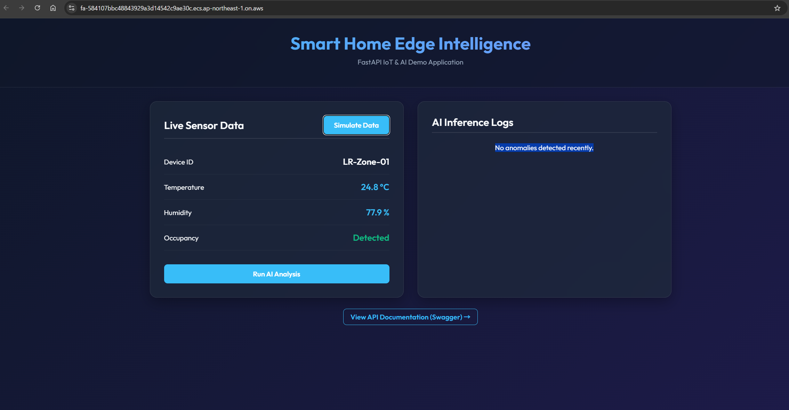
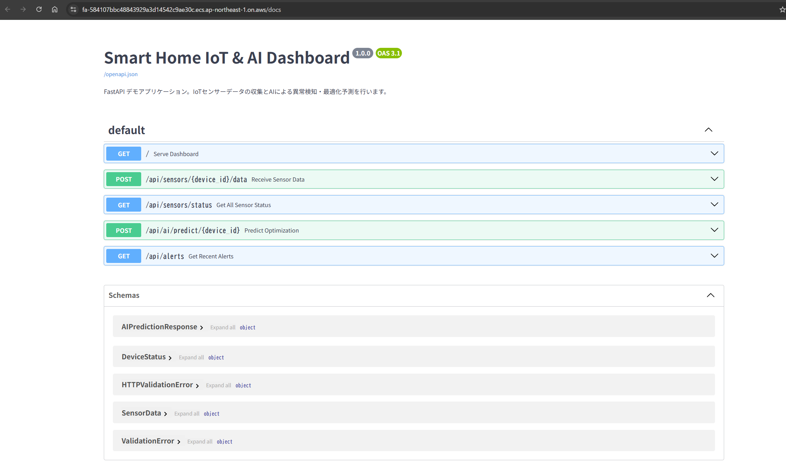
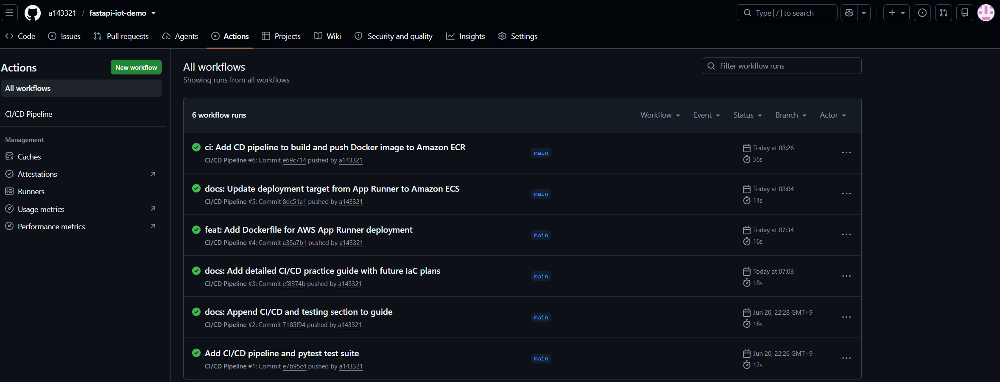
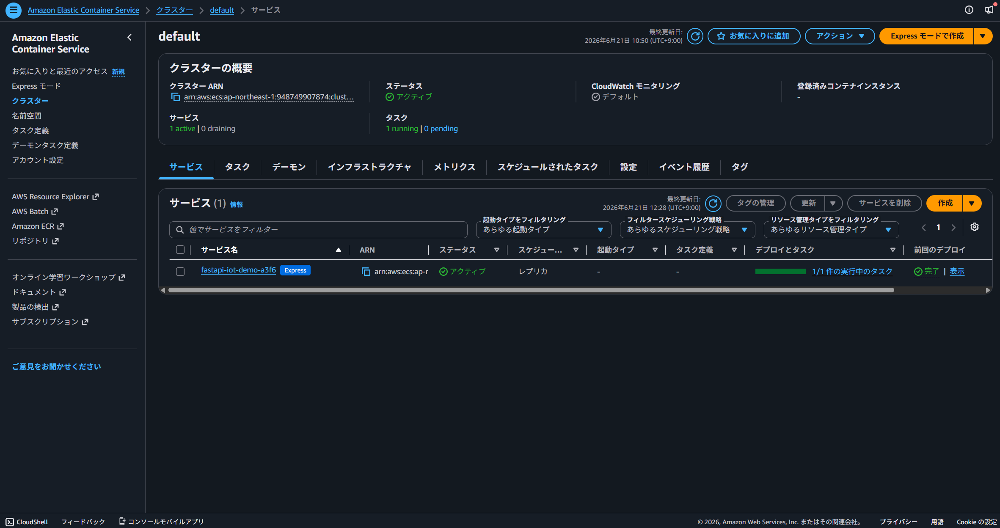
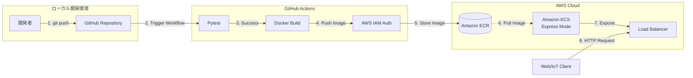

# 🚀 Smart Home Edge Intelligence - FastAPI IoT & AI Demo


架空の「スマートホーム向けエッジAIデバイス」を想定した、IoTセンサーデータの収集および異常検知（ダミー推論）を行うバックエンドAPIシステムです。

単なるアプリケーションの開発にとどまらず、**「実務を想定したインフラ構築とCI/CDパイプラインの自動化」** に重点を置いて設計・実装しています。

## 🌟 アピールポイント（実務想定の設計）

1. **GitHub Actionsによる完全自動CDパイプライン**
   - コードを `main` ブランチにPushするだけで、自動的に `pytest` による単体テストが実行されます。
   - テスト成功時のみDockerイメージがビルドされ、AWS ECRに自動プッシュされます。
2. **AWS ECS (Fargate) によるコンテナ運用とIAM設計 (OIDC連携)**
   - フルマネージドなコンテナ環境（ECS Express Mode）を採用し、スケーラビリティを確保。
   - CI/CDパイプラインにはセキュリティベストプラクティスである「OIDC (OpenID Connect)」を採用し、永続的なアクセスキーを廃止したセキュアな設計を行っています。詳細は [OIDCマイグレーションガイド](./docs/oidc_migration_guide.md) を参照。
3. **Pydanticによる堅牢なデータバリデーション**
   - IoTデバイスから送信されるJSONデータ（温度、湿度、モーションセンサー等）の型チェックと制約を厳密に定義し、不正なデータの混入をAPIの入り口で防ぎます。
4. **Terraformによるインフラのコード化 (IaC)**
   - 再現性の確保と属人化の排除のため、本番運用のインフラストラクチャをTerraformでコード化しています。
   - ※詳細は [IaC / Terraform ガイド](./docs/iac_terraform_guide.md) および `terraform/` ディレクトリを参照。
5. **継続的な拡張を前提としたロードマップ**
   - 単なるPoCにとどまらず、OIDC連携によるセキュリティ強化やDynamoDBによるデータ永続化など、実務を見据えた拡張を段階的に実施しています。
   - ※詳細は [今後のロードマップ](./docs/future_roadmap.md) を参照。

## 📸 スクリーンショット

### 1. IoTダッシュボード UI
フロントエンドとの結合を想定したデモ用のダークモードUIです。


### 2. API仕様（Swagger UI）
FastAPIによって自動生成される、OpenAPI準拠のインタラクティブなAPIドキュメントです。


### 3. CI/CD パイプライン（GitHub Actions）
Pushをトリガーにテスト・ビルド・AWS ECRへのプッシュが全自動で実行されます。


### 4. AWS クラウドインフラ（Amazon ECS）
コンテナはAWS上で稼働し、パブリックエンドポイントを介して世界中に公開されています。


---

## 🏗 システムアーキテクチャ

以下の図は、本プロジェクトの継続的インテグレーション・デプロイ（CI/CD）およびクラウドインフラの全体像を示しています。



## 🛠 技術スタック

- **Backend Framework**: Python, FastAPI, Pydantic
- **Testing**: Pytest, httpx
- **Containerization**: Docker
- **CI/CD**: GitHub Actions
- **Cloud Infrastructure**: Amazon Web Services (AWS)
  - Amazon ECR (Elastic Container Registry)
  - Amazon ECS (Elastic Container Service / Express Mode)
  - AWS IAM (Identity and Access Management)
  - Terraform (Infrastructure as Code)
- **Frontend (Demo)**: HTML5, Vanilla CSS, JavaScript

## 💻 ローカル環境での動かし方

Dockerを使用して、ローカル環境で簡単にAPIを起動できます。

```bash
# リポジトリのクローン
git clone https://github.com/yourusername/fastapi-iot-demo.git
cd fastapi-iot-demo

# Dockerコンテナのビルドと起動
docker build -t fastapi-iot-demo .
docker run -d -p 8000:8000 fastapi-iot-demo

# ブラウザでアクセス
# デモUI: http://localhost:8000/
# APIドキュメント: http://localhost:8000/docs
```
