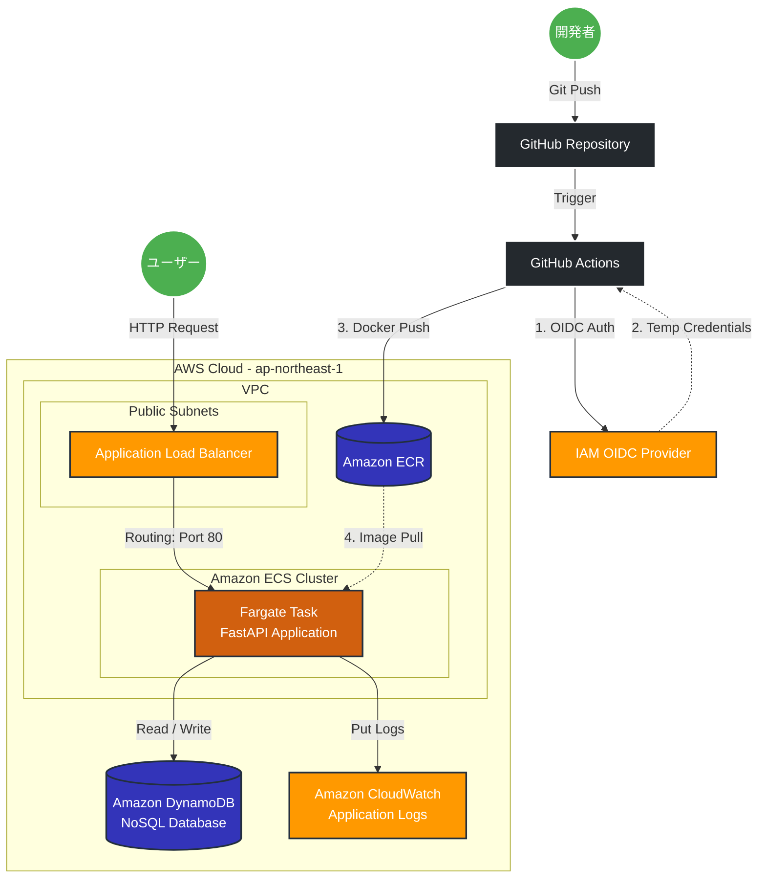

# システムアーキテクチャ構成図

本プロジェクトのインフラ構成図（Terraformによって構築されたAWSリソースとCI/CDパイプライン）です。

## アーキテクチャ構成図（Mermaid）

## アーキテクチャの特長

1. **2層構造（ECRとアプリ基盤の分離）**: 
   図の中央にある `Amazon ECR` と `VPC` 内部のリソースはTerraform上で分離されています。これによりVPC側を破棄してもECRが残り、CI/CDパイプラインを保護します。
2. **完全なサーバーレス（Fargate & DynamoDB）**: 
   EC2サーバーの運用保守が不要な「フルマネージド」なサーバーレスアーキテクチャを採用しており、運用コストとセキュリティリスクを最小化しています。
3. **セキュアなOIDC認証**:
   GitHub ActionsからAWSへのデプロイにはIAMアクセスキーを使用せず、OIDC（OpenID Connect）を利用した一時的な認証情報を利用し、漏洩リスクを根本から防いでいます。
