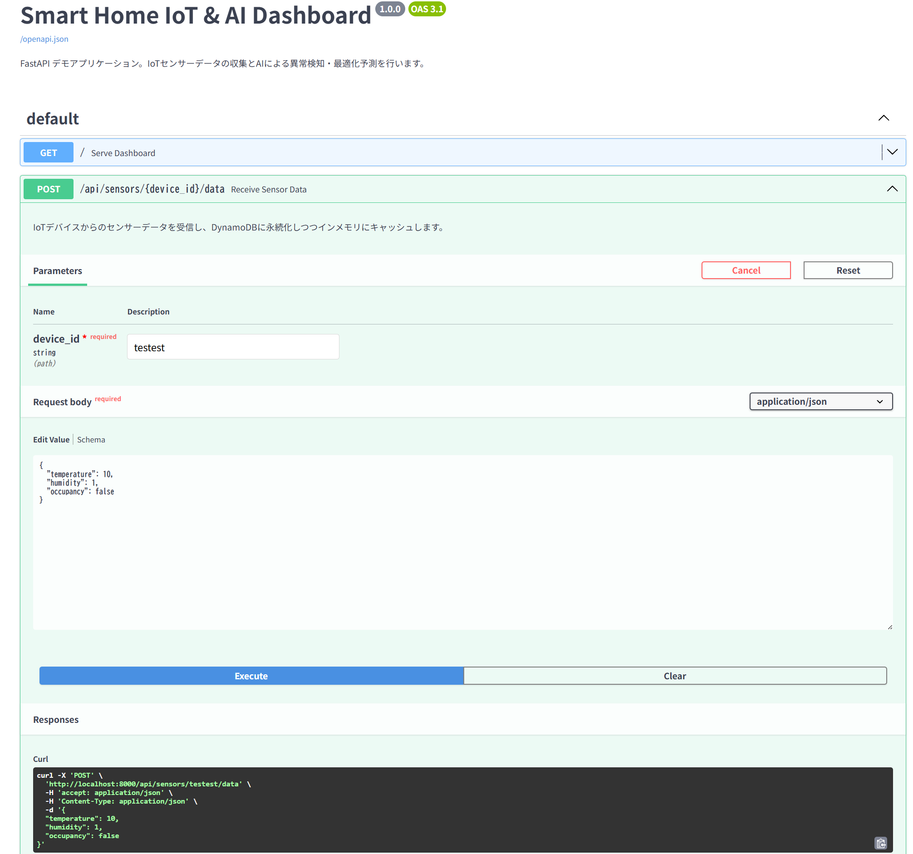
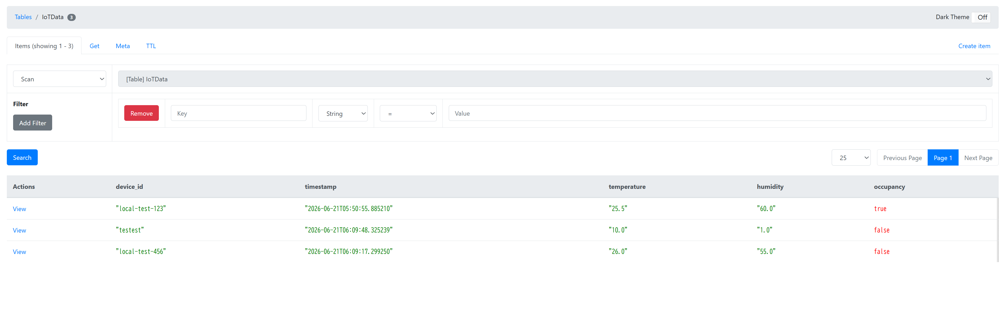

# ローカル開発・テスト環境ガイド

本プロジェクトでは、AWS（クラウド）へデプロイする前に手元のPCだけで安全かつ高速にテストができるよう、Docker Composeを用いたローカル環境を用意しています。

この環境では、無料の「DynamoDB Local」を利用するため、**クラウドの課金や権限エラーを気にすることなく、オフラインでも開発を進めることが可能**です。

## 🚀 ローカル環境の起動方法

ターミナルを開き、プロジェクトのルートディレクトリで以下のコマンドを実行します。

```bash
docker compose up -d
```

これにより、以下の2つのコンテナが起動します。
1. **APIサーバー** (`fastapi-iot-demo-api-1`): アプリケーション本体
2. **ローカルDB** (`fastapi-iot-demo-dynamodb-local-1`): ダミーのDynamoDB
3. **DB管理GUI** (`fastapi-iot-demo-dynamodb-admin-1`): DBの中身を見るためのブラウザツール

> [!TIP]
> コンテナを停止・削除したい場合は `docker compose down` を実行してください。

---

## 💻 ローカル環境での動作確認手順

### 1. データの送信テスト（Swagger UI）

FastAPIが自動生成するAPIドキュメント（Swagger UI）を使って、実際のアプリからAPIを叩くテストを行います。

1. ブラウザで **`http://localhost:8000/docs`** にアクセスします。
2. `POST /api/sensors/{device_id}/data` のアコーディオンを開きます。
3. 右上の **「Try it out」** をクリックします。
4. `device_id` に任意の文字列（例: `test-device-01`）を入力します。
5. Request body（JSON）はサンプルのままでOKです。
6. 大きな青い **「Execute」** ボタンをクリックします。

下部の「Server response」エリアに `200` のステータスコードと結果のJSONが表示されれば、APIのロジックは正常に動作しています。



### 2. 保存されたデータの目視確認（DynamoDB Admin）

APIが本当にデータベース（DynamoDB Local）にデータを書き込めたのか、GUIツールを使って確認します。

1. ブラウザで **`http://localhost:8002`** にアクセスします。
2. これはAWSコンソールそっくりに作られたOSSの管理画面です。
3. 左側のメニューにある **`IoTData`** テーブルをクリックします。
4. 先ほどSwagger UIから送信したデータ（例: `test-device-01`）が、表形式で保存されていることが確認できます。



> [!NOTE]
> `docker-compose.yml` にて `-inMemory` オプションを指定しているため、コンテナを再起動（`down` して `up`）するとローカルDBのデータは綺麗にリセットされます。テストのたびにゴミデータが残らない便利な仕様です。

---

## 🛠️ コードを変更した場合の反映

ローカル環境起動中に `main.py` などのソースコードを変更した場合、Docker Composeの `volumes` 設定により、**コンテナ内のコードも即座に同期されます。**

APIサーバー（Uvicorn）が自動的にリロードされるため、コードを保存したらすぐにブラウザ（Swagger UI）を更新して、変更後の挙動をテストすることができます。

ローカルで動作確認が完璧に完了したら、`git push` してAWS本番環境へデプロイしましょう！
